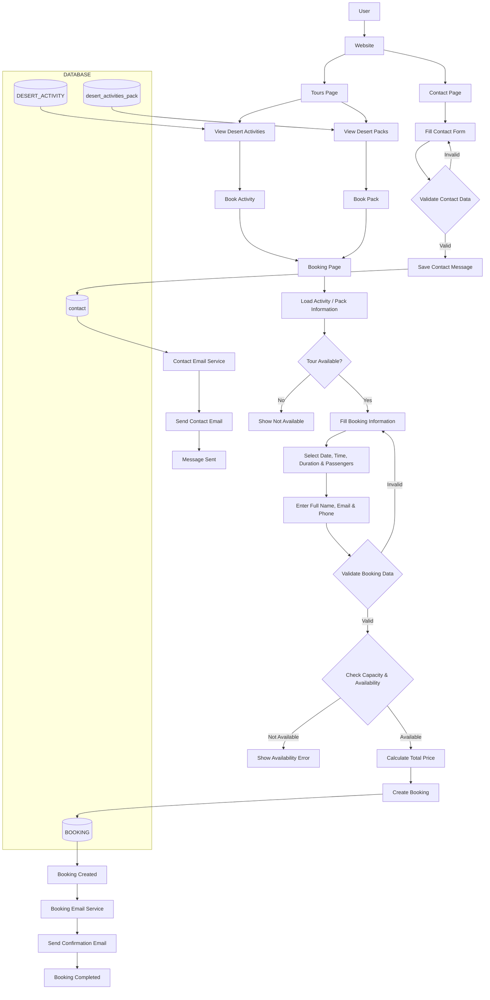

```mermaid
flowchart TD

A[User] --> B[Website]

B --> C[Tours Page]
B --> CT[Contact Page]

C --> D[View Desert Activities]
C --> E[View Desert Packs]

subgraph DATABASE

DA[(DESERT_ACTIVITY)]
DP[(desert_activities_pack)]
BK[(BOOKING)]
CO[(contact)]

end

DA --> D
DP --> E

D --> F[Book Activity]
E --> G[Book Pack]

F --> H[Booking Page]
G --> H

H --> I[Load Activity / Pack Information]

I --> J{Tour Available?}

J -- No --> X[Show Not Available]
J -- Yes --> K[Fill Booking Information]

K --> L[Select Date, Time, Duration & Passengers]

L --> M[Enter Full Name, Email & Phone]

M --> N{Validate Booking Data}

N -- Invalid --> K
N -- Valid --> O{Check Capacity & Availability}

O -- Not Available --> P[Show Availability Error]
O -- Available --> Q[Calculate Total Price]

Q --> R[Create Booking]

R --> BK

BK --> S[Booking Created]

S --> T[Booking Email Service]

T --> U[Send Confirmation Email]

U --> V[Booking Completed]

CT --> W[Fill Contact Form]

W --> Y{Validate Contact Data}

Y -- Invalid --> W
Y -- Valid --> Z[Save Contact Message]

Z --> CO

CO --> AA[Contact Email Service]

AA --> AB[Send Contact Email]

AB --> AC[Message Sent]
```